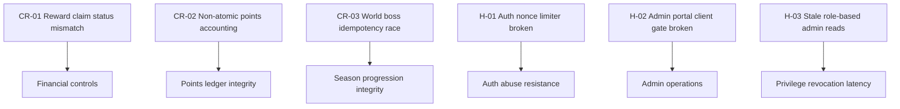
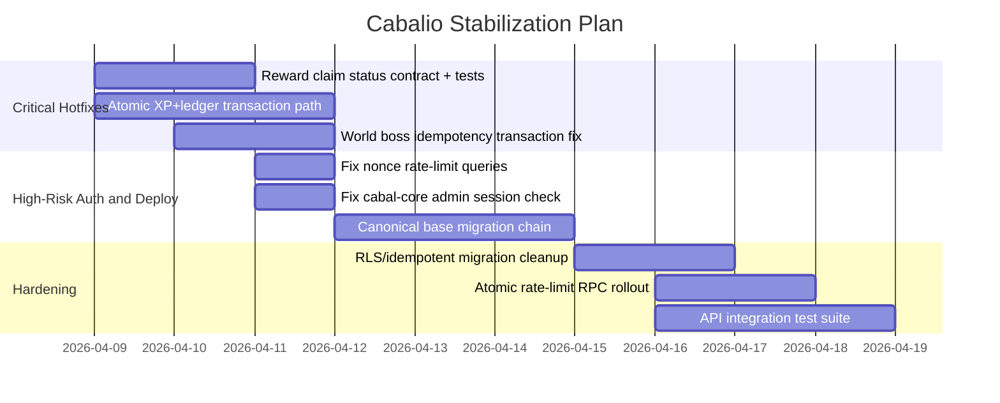

# greg_readthis

Generated: 2026-04-08
Scope: full repository audit (`src/**`, `supabase/migrations/**`, tooling, docs)
Method: parallel audit lanes (API/security, points/rewards logic, frontend/admin flow, DB/migrations/tooling) + local verification commands

## Command Reality Check
- `npm run lint`: failed (2 errors, 5 warnings)
- `npx tsc --noEmit`: failed (2 errors)
- `npm test`: passed (4 files, 96 tests)
- `npm run build`: passed

## Risk Snapshot

## Findings (Highest Risk First)

### Critical

#### CR-01: Reward claim persistence is broken by status enum drift
Evidence:
- `reward_claims` status check only allows `pending_payout | processing | completed | failed` in [supabase/migrations/20260325_security_audit_fixes.sql:56](/Users/swrm/Documents/032526/cabalio/supabase/migrations/20260325_security_audit_fixes.sql:56).
- Claim route inserts `status: 'paid'` in [src/app/api/rewards/claim/route.ts:205](/Users/swrm/Documents/032526/cabalio/src/app/api/rewards/claim/route.ts:205).
- Daily limit logic also queries `'paid'` in [src/lib/payout.ts:120](/Users/swrm/Documents/032526/cabalio/src/lib/payout.ts:120).
- Insert errors are logged but not surfaced in [src/app/api/rewards/claim/route.ts:211](/Users/swrm/Documents/032526/cabalio/src/app/api/rewards/claim/route.ts:211).
Impact:
- `reward_claims` may fail to record successful payouts.
- Idempotency history and daily-limit accounting become unreliable.
Remediation:
- Make one canonical claim status model and enforce it in both migration and code.
- Fail the request if claim persistence fails after payout, and enqueue compensation handling.
- Add route + migration contract tests for reward-claim status compatibility.

#### CR-02: Points accounting is non-atomic and can permanently drift
Evidence:
- Manual admin points updates `users.total_xp` first, then inserts ledger in [src/app/api/admin/points/route.ts:147](/Users/swrm/Documents/032526/cabalio/src/app/api/admin/points/route.ts:147) and [src/app/api/admin/points/route.ts:171](/Users/swrm/Documents/032526/cabalio/src/app/api/admin/points/route.ts:171).
- Submission approval updates user XP and then inserts ledger without checking insert result in [src/app/api/admin/submissions/[id]/review/route.ts:284](/Users/swrm/Documents/032526/cabalio/src/app/api/admin/submissions/[id]/review/route.ts:284) and [src/app/api/admin/submissions/[id]/review/route.ts:317](/Users/swrm/Documents/032526/cabalio/src/app/api/admin/submissions/[id]/review/route.ts:317).
- Rejection cascade writes penalty ledger entries but does not adjust `users.total_xp` in [src/app/api/admin/submissions/[id]/review/route.ts:149](/Users/swrm/Documents/032526/cabalio/src/app/api/admin/submissions/[id]/review/route.ts:149).
- Auto-approved quest bonuses in admin review write ledger entries without XP sync in [src/app/api/admin/submissions/[id]/review/route.ts:364](/Users/swrm/Documents/032526/cabalio/src/app/api/admin/submissions/[id]/review/route.ts:364).
Impact:
- `users.total_xp` and `points_ledger` can diverge permanently.
- Leaderboards, profiles, and payouts can become inconsistent.
Remediation:
- Move all XP+ledger mutations to single DB transaction/RPC functions.
- Add reconciliation job: `SUM(points_ledger.points_delta)` vs `users.total_xp`.
- Block response success until both writes commit.

#### CR-03: World-boss idempotency is race-prone and can double-apply progress
Evidence:
- Idempotency key is checked first in [src/app/api/admin/seasons/[seasonId]/world-boss/progress/route.ts:71](/Users/swrm/Documents/032526/cabalio/src/app/api/admin/seasons/[seasonId]/world-boss/progress/route.ts:71).
- Progress is mutated before idempotency log insert in [src/app/api/admin/seasons/[seasonId]/world-boss/progress/route.ts:127](/Users/swrm/Documents/032526/cabalio/src/app/api/admin/seasons/[seasonId]/world-boss/progress/route.ts:127) and [src/app/api/admin/seasons/[seasonId]/world-boss/progress/route.ts:166](/Users/swrm/Documents/032526/cabalio/src/app/api/admin/seasons/[seasonId]/world-boss/progress/route.ts:166).
Impact:
- Concurrent duplicate requests can mutate progress more than once.
- Later uniqueness failure does not undo already-applied progress changes.
Remediation:
- Insert idempotency row first with `ON CONFLICT DO NOTHING RETURNING`.
- Only apply progress update when idempotency insert succeeds.
- Wrap both steps in one transaction.

### High

#### H-01: Auth nonce rate-limit queries target a nonexistent column
Evidence:
- `auth_nonces` schema has no `id` column in [supabase/migrations/20260325_auth_nonces.sql:4](/Users/swrm/Documents/032526/cabalio/supabase/migrations/20260325_auth_nonces.sql:4).
- Nonce endpoint selects `id` for count in [src/app/api/auth/nonce/route.ts:46](/Users/swrm/Documents/032526/cabalio/src/app/api/auth/nonce/route.ts:46).
- Verify endpoint repeats same pattern in [src/app/api/auth/verify/route.ts:51](/Users/swrm/Documents/032526/cabalio/src/app/api/auth/verify/route.ts:51).
Impact:
- Brute-force throttling is likely degraded or bypassed.
Remediation:
- Count using `nonce` (or `*`) and hard-fail on query errors.
- Add integration test covering nonce and verify rate-limit behavior.

#### H-02: Admin portal client gate currently denies real admins
Evidence:
- Session endpoint returns `{ session }` in [src/app/api/auth/session/route.ts:12](/Users/swrm/Documents/032526/cabalio/src/app/api/auth/session/route.ts:12).
- Admin UI checks `data.session?.isAdmin` in [src/app/cabal-core/page.tsx:396](/Users/swrm/Documents/032526/cabalio/src/app/cabal-core/page.tsx:396) even though session shape uses `role`.
Impact:
- Admins can be blocked from moderation UI despite valid backend permissions.
Remediation:
- Check `data.session?.role === 'admin'`.
- Add a UI regression test for `/cabal-core` auth-state handling.

#### H-03: Some elevated reads trust token role claim until cookie expiry
Evidence:
- Session TTL defaults to 24h in [src/lib/auth.ts:7](/Users/swrm/Documents/032526/cabalio/src/lib/auth.ts:7).
- Middleware gates admin pages by `session.role` in [middleware.ts:74](/Users/swrm/Documents/032526/cabalio/middleware.ts:74).
- Multiple non-admin APIs branch on `session.role === 'admin'` (for elevated read scope) in [src/app/api/submissions/route.ts:180](/Users/swrm/Documents/032526/cabalio/src/app/api/submissions/route.ts:180), [src/app/api/submissions/[id]/route.ts:37](/Users/swrm/Documents/032526/cabalio/src/app/api/submissions/[id]/route.ts:37), [src/app/api/submissions/[id]/appeal/route.ts:137](/Users/swrm/Documents/032526/cabalio/src/app/api/submissions/[id]/appeal/route.ts:137), [src/app/api/profile/[address]/route.ts:37](/Users/swrm/Documents/032526/cabalio/src/app/api/profile/[address]/route.ts:37).
Impact:
- Revoked admins may retain elevated read access until token expiry.
Remediation:
- Re-check admin status from DB on privileged read paths, or shorten session TTL substantially.

#### H-04: Migration strategy is not a single source of truth
Evidence:
- README says to run schema SQL in `db.ts` OR migrations in [README.md:32](/Users/swrm/Documents/032526/cabalio/README.md:32).
- `SCHEMA_SQL` only defines legacy core tables in [src/lib/db.ts:41](/Users/swrm/Documents/032526/cabalio/src/lib/db.ts:41).
- Migrations assume base tables already exist, e.g. alter `users` in [supabase/migrations/20260324_audit_hardening.sql:4](/Users/swrm/Documents/032526/cabalio/supabase/migrations/20260324_audit_hardening.sql:4).
Impact:
- Fresh environments are non-deterministic and can miss required tables/policies.
Remediation:
- Create canonical base migration chain for all tables/functions.
- Deprecate manual `SCHEMA_SQL` bootstrap path.

#### H-05: "Two-admin approval" is currently honor-system only
Evidence:
- Route claims dual-control requirement in [src/app/api/admin/points/route.ts:9](/Users/swrm/Documents/032526/cabalio/src/app/api/admin/points/route.ts:9).
- Enforcement only verifies provided `approving_admin` belongs to admin set in [src/app/api/admin/points/route.ts:70](/Users/swrm/Documents/032526/cabalio/src/app/api/admin/points/route.ts:70), with no second-party proof.
Impact:
- Single admin can bypass intended dual-approval by naming another known admin wallet.
Remediation:
- Implement second-admin signed approval record (separate endpoint + immutable approval row).

### Medium

#### M-01: Notifications and appeals migrations are weakly idempotent and not RLS-hardened
Evidence:
- Notifications migration creates indexes without `IF NOT EXISTS` in [supabase/migrations/20260329_notifications.sql:13](/Users/swrm/Documents/032526/cabalio/supabase/migrations/20260329_notifications.sql:13).
- Appeals migration does the same in [supabase/migrations/20260330_appeals.sql:14](/Users/swrm/Documents/032526/cabalio/supabase/migrations/20260330_appeals.sql:14).
- Neither migration explicitly enables RLS.
Impact:
- Re-run migration failures in CI/provisioning.
- Access safety depends on external grant defaults.
Remediation:
- Add `IF NOT EXISTS` to indexes.
- Explicitly enable RLS and define policies.

#### M-02: Community stats knowingly undercount total points
Evidence:
- Endpoint currently sums raw rows and notes Supabase row-limit truncation in [src/app/api/community-stats/route.ts:31](/Users/swrm/Documents/032526/cabalio/src/app/api/community-stats/route.ts:31).
- RPC fix exists in [supabase/migrations/20260401_sum_positive_points.sql:3](/Users/swrm/Documents/032526/cabalio/supabase/migrations/20260401_sum_positive_points.sql:3) but is not used.
Impact:
- Public-facing totals are inaccurate at scale.
Remediation:
- Switch endpoint to `rpc('sum_positive_points')`.

#### M-03: Rate-limit counters use non-atomic read-modify-write patterns
Evidence:
- Submission limiter in [src/app/api/submissions/route.ts:78](/Users/swrm/Documents/032526/cabalio/src/app/api/submissions/route.ts:78).
- Export limiter in [src/app/api/me/export/route.ts:37](/Users/swrm/Documents/032526/cabalio/src/app/api/me/export/route.ts:37).
- Quest submit limiter in [src/app/api/seasons/current/quests/[questId]/submit/route.ts:29](/Users/swrm/Documents/032526/cabalio/src/app/api/seasons/current/quests/[questId]/submit/route.ts:29).
Impact:
- Concurrent requests can slip past limit windows.
Remediation:
- Replace with atomic SQL increment function (`update ... returning`) or dedicated RPC.

#### M-04: Quality gates are currently red in repo state
Evidence:
- Lint errors in [src/components/layout/Header.tsx:81](/Users/swrm/Documents/032526/cabalio/src/components/layout/Header.tsx:81) and [src/components/layout/TopNav.tsx:76](/Users/swrm/Documents/032526/cabalio/src/components/layout/TopNav.tsx:76).
- Typecheck errors from env mutation in [src/lib/auth.test.ts:326](/Users/swrm/Documents/032526/cabalio/src/lib/auth.test.ts:326) and [src/lib/auth.test.ts:329](/Users/swrm/Documents/032526/cabalio/src/lib/auth.test.ts:329), with tests included by tsconfig in [tsconfig.json:25](/Users/swrm/Documents/032526/cabalio/tsconfig.json:25).
Impact:
- Merge safety and release confidence are reduced.
Remediation:
- Fix test env mutation typing and hook anti-pattern lint violations.
- Enforce lint+tsc in CI as required checks.

#### M-05: High-risk APIs are effectively untested
Evidence:
- Current tests are only [src/lib/auth.test.ts](/Users/swrm/Documents/032526/cabalio/src/lib/auth.test.ts), [src/lib/points.test.ts](/Users/swrm/Documents/032526/cabalio/src/lib/points.test.ts), [src/lib/payout.test.ts](/Users/swrm/Documents/032526/cabalio/src/lib/payout.test.ts), [src/lib/upload-security.test.ts](/Users/swrm/Documents/032526/cabalio/src/lib/upload-security.test.ts).
- Vitest coverage target is lib-only in [vitest.config.ts:11](/Users/swrm/Documents/032526/cabalio/vitest.config.ts:11).
Impact:
- No automated protection for auth flow, reward-claim flow, admin moderation, and season mutation routes.
Remediation:
- Add API integration tests for auth/nonce, rewards claim, admin review, and points reconciliation.

## 14-Day Remediation Order

## Fast Win Checklist
- Align `reward_claims.status` values between migration and runtime code.
- Patch `/cabal-core` client admin check (`role` not `isAdmin`).
- Fix `auth_nonces` count queries to use real columns.
- Convert XP+ledger writes to transactional RPCs.
- Replace community stats raw sum with `sum_positive_points()` RPC.
- Update docs that currently claim zero TS errors while `tsc --noEmit` fails.
